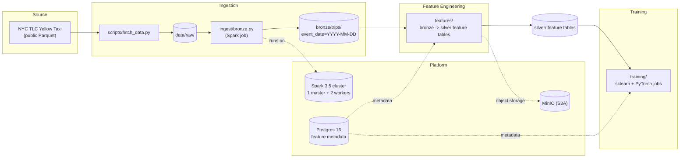

# sparkfeaturestore

Distributed feature pipeline + ML training platform built on Apache Spark 3.5,
Parquet, Postgres 16 and MinIO (S3-compatible object storage).

## Architecture



Pipeline: **raw -> bronze -> silver feature tables -> training** with schema
contracts and data-quality gates in `quality/`.

## Silver feature layer

Feature groups are declared in `conf/features.yaml` (entity key, source,
window spec, aggregations, output path) and built with `make silver`:

| Group | Grain | Features |
|---|---|---|
| `pickup_zone_demand` | per pickup event | per PULocationID trailing pickup counts + mean fare over 1h/6h/24h |
| `driver_trip_history` | vendor/day | trip count, mean trip distance, mean tip ratio over 7d/30d |
| `trip_features` | per trip | as-of join of both groups + `tip_pct` label (tip/fare, clipped [0,1]) |

Point-in-time correctness (hard requirement):

* trailing aggregates are Spark window functions over `rangeBetween` on a
  unix-seconds column -- never a naive groupBy join; frames end at
  `T-1` second (event grain) or `T-1` day (day grain), so same-timestamp
  and future rows never leak (`features/point_in_time.py`);
* `as_of_join(spine, feature_df, ts_col, keys, tolerance)` is a backward
  as-of join that matches the most recent feature row at or before the
  spine timestamp and never looks forward;
* every run is registered in Postgres `feature_runs` (run_id,
  feature_group, row_count, input_paths, output_path, spark_conf_json,
  git_sha, started_at, finished_at, status) via `features/registry.py`.

Output: partitioned Parquet under
`silver/<group>/event_date=YYYY-MM-DD/`.

## Quality gates

Before ANY write, every group passes gates (`quality/contracts.py`,
`quality/checks.py`): declarative schema contracts (columns, Spark types,
nullability, value ranges), row-count floor vs the prior partition, null-rate
ceilings, duplicate primary-key count = 0, freshness (max event_ts within the
expected window). A violation raises `DataQualityError`, records a failure
row in Postgres `quality_results`, aborts promotion from staging and exits
non-zero — the previous good partition stays untouched.

## Training

Two jobs read the SAME silver tables with an identical time-based
train/val/test split (`training/data.py`, never random):

```bash
make train-sklearn   # HistGradientBoostingRegressor pipeline
make train-torch     # PyTorch MLP with embeddings for zone/vendor ids
```

Each run writes `artifacts/<framework>/<run_id>/` (model file, metrics.json,
feature list, hyperparameters, git sha, feature_run_ids) and registers a row
in Postgres `model_runs` (FK to `feature_runs`). Metrics: RMSE/MAE/R2 on the
held-out test window vs a predict-the-mean baseline.

## Layout

```
common/       spark session builder, config, logging, S3/MinIO IO helpers
ingest/       raw -> bronze jobs
features/     bronze -> silver feature tables
training/     sklearn + pytorch jobs
quality/      schema contracts + data-quality gates
conf/         YAML configs per environment (local, docker, k8s)
docker/       Spark image (apache/spark:3.5.9 + pinned Python deps)
k8s/          standalone-mode manifests for dev clusters
scripts/      fetch_data.py (NYC TLC downloader)
tests/        unit tests (pytest)
data/         downloaded datasets + pipeline outputs (gitignored)
```

## Quickstart

```bash
make up       # build + start spark-master, 2 workers, minio, postgres
make fetch    # download 1 month (Jan 2023, ~150 MB); MONTHS=12 for all 2023
make bronze   # run bronze ingest on the Spark cluster
make silver   # build silver feature groups + register runs in Postgres
make test     # unit tests (incl. point-in-time correctness)
make lint     # ruff + black checks
```

The bronze job writes real Hive-style partitions:

```
data/bronze/trips/
├── event_date=2023-01-01/
│   └── part-00000-*.parquet
├── event_date=2023-01-02/
...
└── event_date=2023-01-31/
```

## Configuration

| Environment | Config file | Purpose |
|---|---|---|
| `local` | `conf/local.yaml` | local[*] dev on the host, MinIO at localhost:9000 |
| `docker` | `conf/docker.yaml` | jobs inside docker-compose, MinIO at minio:9000 |
| `k8s` | `conf/k8s.yaml` | Spark on Kubernetes, S3A object storage |

Select with `APP_ENV` / `--env`; pick the Spark profile with `SPARK_PROFILE` /
`--profile` (`local`, `cluster`, `k8s`).

## Services (docker-compose)

| Service | Port(s) | Notes |
|---|---|---|
| spark-master | 8080 (UI), 7077 (cluster) | standalone master |
| spark-worker-1/2 | 8081 / 8082 (UI) | 2 cores / 2 GB each |
| minio | 9000 (S3), 9001 (console) | `minioadmin` / `minioadmin` |
| postgres | 5432 | db `feature_store`, user `sparkfs` / `sparkfs` |

## Python environment

`uv` is the package manager (pinned deps in `pyproject.toml`; `uv run` is used
by the Makefile). Without `uv`, run `make venv` to fall back to
`requirements.txt` + pip.
