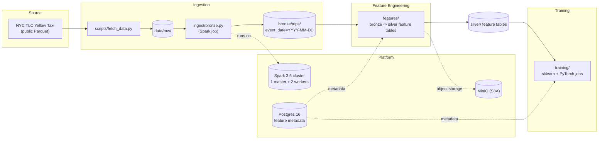

# sparkfeaturestore

Distributed feature pipeline + ML training platform built on Apache Spark 3.5,
Parquet, Postgres 16 and MinIO (S3-compatible object storage).

## Architecture



Pipeline: **raw -> bronze -> silver feature tables -> training** with schema
contracts and data-quality gates in `quality/`.

## Layout

```
common/       spark session builder, config, logging, S3/MinIO IO helpers
ingest/       raw -> bronze jobs
features/     bronze -> silver feature tables
training/     sklearn + pytorch jobs
quality/      schema contracts + data-quality gates
conf/         YAML configs per environment (local, docker, k8s)
docker/       Spark image (apache/spark:3.5.9 + pinned Python deps)
k8s/          standalone-mode manifests for dev clusters
scripts/      fetch_data.py (NYC TLC downloader)
tests/        unit tests (pytest)
data/         downloaded datasets + pipeline outputs (gitignored)
```

## Quickstart

```bash
make up       # build + start spark-master, 2 workers, minio, postgres
make fetch    # download 1 month (Jan 2023, ~150 MB); MONTHS=12 for all 2023
make bronze   # run bronze ingest on the Spark cluster
make test     # unit tests
make lint     # ruff + black checks
```

The bronze job writes real Hive-style partitions:

```
data/bronze/trips/
├── event_date=2023-01-01/
│   └── part-00000-*.parquet
├── event_date=2023-01-02/
...
└── event_date=2023-01-31/
```

## Configuration

| Environment | Config file | Purpose |
|---|---|---|
| `local` | `conf/local.yaml` | local[*] dev on the host, MinIO at localhost:9000 |
| `docker` | `conf/docker.yaml` | jobs inside docker-compose, MinIO at minio:9000 |
| `k8s` | `conf/k8s.yaml` | Spark on Kubernetes, S3A object storage |

Select with `APP_ENV` / `--env`; pick the Spark profile with `SPARK_PROFILE` /
`--profile` (`local`, `cluster`, `k8s`).

## Services (docker-compose)

| Service | Port(s) | Notes |
|---|---|---|
| spark-master | 8080 (UI), 7077 (cluster) | standalone master |
| spark-worker-1/2 | 8081 / 8082 (UI) | 2 cores / 2 GB each |
| minio | 9000 (S3), 9001 (console) | `minioadmin` / `minioadmin` |
| postgres | 5432 | db `feature_store`, user `sparkfs` / `sparkfs` |

## Python environment

`uv` is the package manager (pinned deps in `pyproject.toml`; `uv run` is used
by the Makefile). Without `uv`, run `make venv` to fall back to
`requirements.txt` + pip.
