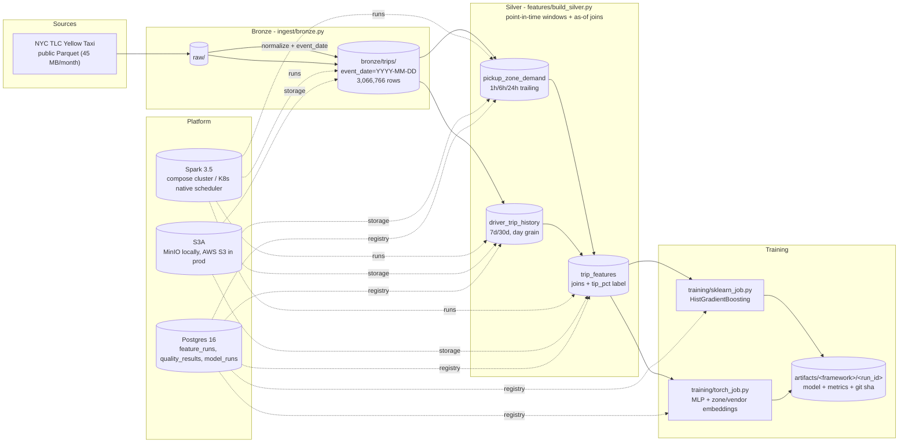

# sparkfeaturestore

A distributed feature pipeline and ML training platform on Apache Spark 3.5.
It ingests the public NYC TLC Yellow Taxi dataset (Parquet), builds
point-in-time-correct feature tables on a Spark cluster (local
docker-compose or Kubernetes with S3A object storage), gates every write
behind schema contracts and data-quality checks, and trains two models
(scikit-learn gradient boosting and a PyTorch MLP with embeddings) from
the **same** silver tables with an identical time-based split. Every
pipeline and training run is registered in Postgres with full provenance
(feature_runs -> model_runs foreign keys). The point is not the taxi data
-- it is a demonstration of production plumbing: skew handling, atomic
writes, retries, idempotency, quality gates that fail the job instead of
writing bad partitions, and the same code running on a laptop, a compose
cluster, and Kubernetes.

## Architecture



Pipeline: **raw -> bronze -> silver features -> training**, with schema
contracts and data-quality gates (`quality/`) that abort the write and
leave the previous good partition untouched on any violation.

## Quickstart

Prerequisites: Docker (with compose plugin), uv, ~8 GB RAM free. No local
Java needed -- Spark runs in containers. Five commands to a trained model
on a 1-month slice (~3M rows, Jan 2023):

```bash
make up             # build + start spark-master, 2 workers, minio, postgres
make fetch          # download Jan 2023 taxi parquet (45 MB)
make bronze         # bronze ingest on the Spark cluster
make silver         # silver feature groups + Postgres registration
make train-sklearn  # sklearn model, artifacts/ + model_runs row
```

`make train-torch` runs the PyTorch job. `make test`, `make lint`,
`make typecheck`, `make coverage`, `make integration` for verification;
`make k8s-up && make k8s-features && make k8s-train` for the Kubernetes
proof (kind cluster). `make help` lists everything.

## Distributed systems decisions

Measured on the docker-compose cluster (4 executor cores) over Jan-2023
(3,066,766 trips). Raw CSVs: `bench/results/skew_bench.csv`,
`bench/results/partition_sweep.csv`.

**Skew** (`features/skew.py`): runtime hot-key detection (24 PULocationIDs
above 50k rows/month; the busiest zone holds ~5% of rows) + salted
two-phase aggregation, verified equal to the unsalted result:

| mode | wall | max task | shuffle read |
|---|---|---|---|
| unsalted groupBy | 0.67s | 290ms | 13 KB |
| salted groupBy | 0.49s | 274ms | 13 KB |
| unsalted full-row shuffle | 0.87s | 395ms | 7.4 MB |
| salted full-row shuffle (2 shuffles) | 1.08s | 375ms | 17.7 MB |

Honest conclusion: at this skew factor salting costs more than it saves;
the threshold is configurable so it engages only when hot keys actually
dominate.

**Shuffle tuning** (sweep of `spark.sql.shuffle.partitions` x AQE on the
real trailing-window workload):

| partitions | AQE | wall | max task |
|---|---|---|---|
| 50 | on | 25.1s | 21.4s |
| 50 | off | 26.3s | 6.7s |
| 200 | on | 24.9s | 21.3s |
| 200 | off | 25.6s | 3.0s |
| 800 | on | 26.9s | 22.7s |
| 800 | off | 37.9s | 1.6s |
| 2000 | on | 23.3s | 18.4s |
| 2000 | off | 26.1s | 2.1s |

AQE's post-shuffle coalescing creates a straggler (one task holds the
hottest zone); small clusters prefer AQE off with partitions >= 200.

**Consistency guarantee** (exactly): writes go to a sibling staging dir,
the old table moves to trash, a single `rename` swaps the new table in,
then `_SUCCESS` is written. On POSIX/HDFS that rename is atomic -- readers
see the complete old table or the complete new table, never a mix, and a
failure rolls back from trash. On S3A, `rename` is copy+delete (NOT
atomic); readers must gate on `_SUCCESS`. The Postgres registry row is a
separate system (no 2PC) -- a crash between write and `finish_run` leaves
a `running` row and the next run rebuilds.

**Retry + idempotency contract**: `common/retry.py` retries only
transient errors (S3 5xx/429, connection reset, timeouts) with exponential
backoff + full jitter; data-quality failures are never retried. Re-running
a completed `run_key` (sha256 of group + git sha + input paths) is a no-op
enforced by a partial unique index in `feature_runs`; `--force` supersedes
the previous success. A kill-mid-write test proves a failed promotion
rolls back and a re-run leaves no duplicate or partial partitions.

## Data quality

Every write passes gates BEFORE promotion (`quality/contracts.py`,
`quality/checks.py`); failures raise `DataQualityError`, record a row in
`quality_results`, and exit non-zero:

| Check | What it enforces |
|---|---|
| schema contract | exact column names + Spark types per table |
| nullability | non-nullable columns have 0 nulls |
| value ranges | per-column min/max (calibrated to real TLC data, e.g. `fare_amount in [-1000, 5000]`, `tip_pct in [0,1]`, `trip_distance in [0, 1e6]` -- negative fares and huge distances exist in the raw data) |
| primary key | duplicate keys = 0 (enforced where the data is actually unique: `driver_trip_history(vendor_id, event_date)`) |
| row count floor | >= 2,000,000 per feature group (1-month slice) |
| partition floor | every `event_date` partition keeps >= 90% of its prior row count |
| null-rate ceilings | e.g. `tip_pct` nulls <= 5%, driver-history joins <= 30% |
| freshness | max(event_ts) inside the expected window |

Contracts: `bronze.trips` (21 columns), `silver.pickup_zone_demand`,
`silver.driver_trip_history`, `silver.trip_features`. Verified live:
corrupting one bronze partition (fares = -99999) failed the
pickup_zone_demand contract with 3 violations, wrote the failure row, and
left the previous silver table byte-identical.

## Results

Task: predict `tip_pct` (tip/fare, clipped to [0,1]) from trip + zone +
history features. Time-based split (never random):
train 1,826,432 / val 500,407 / test 713,721 rows (3,040,560 total).
Features exclude `fare_amount`/`tip_amount` -- they define the label, so
including them would leak it. Measured from a cold clone via the
quickstart (compose cluster):

| model | test RMSE | test MAE | test R2 |
|---|---|---|---|
| mean baseline (predict train mean) | 0.1383 | 0.1141 | 0.0 |
| sklearn HistGradientBoosting (native categoricals) | 0.1319 | 0.1068 | 0.089 |
| PyTorch MLP + embeddings (30-epoch cap, early stop at 28) | 0.1330 | 0.1066 | 0.073 |

Both models beat the baseline; the tip percentage is barely predictable
from these features (R2 ~0.09) -- that is an honest property of the data,
not the pipeline. (The kind-cluster runs of the same code measured
0.1319/0.1068/0.0894 and 0.1337/0.1074/0.0639 for an 8-epoch torch cap.)

## Scale (honest numbers)

| what | value |
|---|---|
| dataset | 1 month (Jan 2023), 45.5 MB raw parquet, 3,066,766 rows |
| bronze | 62 MB, 36 event_date partitions |
| silver | 375 MB across 3 tables |
| compose cluster | 1 master + 2 workers (2 cores / 3 GB each), driver 2 GB |
| kind cluster | 1 node, driver 1 GB + 2 executors x 1 GB |
| wall time (compose) | bronze ~2 min, silver ~5 min |
| wall time (kind, S3A->MinIO) | bronze ~3.5 min, silver ~14 min |
| training (kind pod, 2 CPU) | sklearn fit 20 s, torch 8 epochs ~9 min |

Full-year scale (2023, ~40M rows): fetch with `make fetch MONTHS=12`; EKS
sizing guidance in `docs/deploy-aws.md`.

## Testing

* **Unit (79 tests, ~17 s)**: point-in-time leakage (hand-computed answers
  that fail if same-timestamp or future rows leak), salting correctness
  (salted == unsalted, exact), retry/backoff semantics, every quality
  check (one pass + one fail case each), atomic-write kill-mid-promotion,
  artifact versioning, registry behavior.
* **Coverage**: 89.9% on the non-Spark-session modules (`make coverage`,
  fails under 75%).
* **Integration** (`make integration`, ~15 min, not in the default
  suite): compose up -> bronze -> silver -> sklearn train, asserting row
  counts (3,066,766 / 67 / 3,066,766), metrics beat the baseline, and
  `feature_runs` + `model_runs` rows exist.
* **CI** (`.github/workflows/`): lint (ruff + black + mypy), unit tests +
  coverage, docker builds on every push; the end-to-end integration runs
  behind `workflow_dispatch`.

## Layout

```
common/       spark session builder, config, logging, IO, atomic writes, retry
ingest/       raw -> bronze
features/     bronze -> silver (point-in-time windows, as-of join, skew, registry)
quality/      schema contracts + data-quality gates
training/     shared data loader + sklearn/torch jobs + artifact/registry code
conf/         YAML per environment (local, docker, k8s)
docker/       images: spark (S3A jars, non-root, digest-pinned) + train (torch-cpu)
k8s/          native Spark-on-K8s manifests (kind-verified) + cron refresh
bench/        skew + shuffle-partition benchmarks (REST-API metrics)
docs/         distributed-design.md, deploy-aws.md
tests/        unit + integration
data/         fetched datasets + pipeline outputs (gitignored)
```
